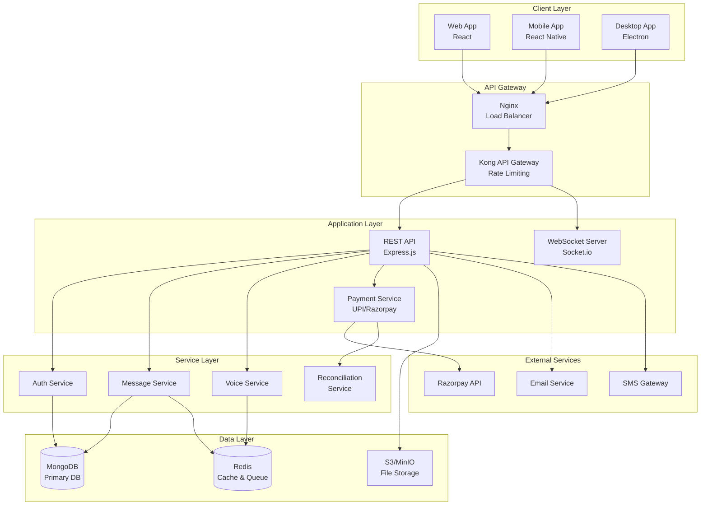
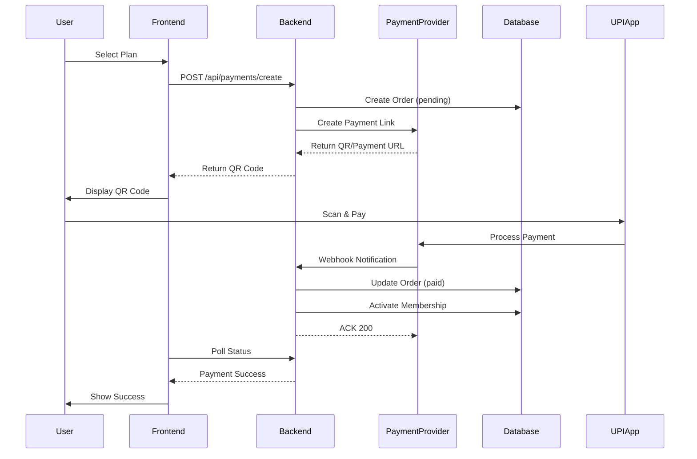

# 🚀 IvanChat - Enterprise Discord-like Chat Platform with UPI Payments

<div align="center">


<p align="center">
  <strong>A feature-rich, scalable, and secure real-time chat platform with integrated UPI payment system for premium memberships</strong>
</p>

[Demo](https://demo.ivanchat.com) • [Documentation](https://docs.ivanchat.com) • [API Reference](https://api.ivanchat.com/docs) • [Report Bug](https://github.com/ivanchat/issues) • [Request Feature](https://github.com/ivanchat/issues)

</div>

---

## 📑 Table of Contents

- [Overview](#-overview)
- [Key Features](#-key-features)
- [Tech Stack](#-tech-stack)
- [System Architecture](#-system-architecture)
- [Prerequisites](#-prerequisites)
- [Installation](#-installation)
- [Configuration](#-configuration)
- [Payment System](#-payment-system)
- [Running the Application](#-running-the-application)
- [API Documentation](#-api-documentation)
- [Testing](#-testing)
- [Deployment](#-deployment)
- [Security](#-security)
- [Performance](#-performance)
- [Monitoring](#-monitoring)
- [Troubleshooting](#-troubleshooting)
- [Contributing](#-contributing)
- [License](#-license)
- [Support](#-support)
- [Acknowledgments](#-acknowledgments)

## 🌟 Overview

IvanChat is an enterprise-grade, Discord-like communication platform that combines real-time messaging, voice/video calls, and seamless UPI payment integration for premium memberships. Built with scalability, security, and user experience in mind, it offers a comprehensive solution for community management and monetization.

### 🎯 Core Value Propositions

- **Real-time Communication**: Instant messaging with WebSocket support
- **Voice & Video**: High-quality voice channels with spatial audio
- **Payment Integration**: Seamless UPI QR payments with auto-activation
- **Enterprise Security**: End-to-end encryption and OAuth 2.0
- **Scalability**: Microservices architecture with horizontal scaling
- **Developer Friendly**: RESTful APIs, WebHooks, and extensive documentation

## ✨ Key Features

### 💬 Communication Features
- **Real-time Messaging**: Instant message delivery with typing indicators
- **Voice Channels**: Crystal-clear voice communication with spatial audio
- **Video Calls**: HD video calling with screen sharing
- **File Sharing**: Secure file uploads up to 1GB (premium)
- **Message Reactions**: Express yourself with emojis and custom reactions
- **Thread Support**: Organized conversations with threaded replies
- **Message Translation**: Real-time translation in 100+ languages
- **Rich Embeds**: Preview links, images, and videos inline

### 💳 Payment & Membership System
- **UPI QR Payments**: Dynamic QR generation for all UPI apps
- **Multiple Providers**: Support for Razorpay, Cashfree, Paytm, PhonePe
- **Auto-Activation**: Instant membership activation on payment
- **Payment Reconciliation**: Automated transaction matching and recovery
- **Refund Management**: Streamlined refund processing
- **Invoice Generation**: Automatic GST-compliant invoices
- **Subscription Tiers**: Monthly, Yearly, and Lifetime plans
- **Payment Analytics**: Comprehensive payment dashboards

### 🎮 Community Features
- **Server Creation**: Unlimited server creation for communities
- **Role Management**: Granular permission system
- **Channel Types**: Text, voice, announcement, and stage channels
- **Member Directory**: Searchable member lists with profiles
- **Moderation Tools**: Auto-mod, word filters, and ban management
- **Custom Emojis**: Upload and use custom server emojis
- **Server Templates**: Quick setup with pre-configured templates
- **Discovery**: Find and join public servers

### 🔐 Security Features
- **End-to-End Encryption**: Military-grade encryption for messages
- **Two-Factor Authentication**: Enhanced account security
- **OAuth 2.0**: Secure third-party authentication
- **Biometric Authentication**: Fingerprint/Face ID support
- **Zero-Knowledge Proof**: Privacy-preserving authentication
- **Audit Logs**: Comprehensive activity tracking
- **IP Whitelisting**: Restrict access by IP ranges
- **Rate Limiting**: DDoS protection and abuse prevention

### 📊 Analytics & Monitoring
- **Real-time Metrics**: Live dashboard with Prometheus/Grafana
- **Payment Analytics**: Transaction trends and success rates
- **User Analytics**: Engagement metrics and retention analysis
- **Performance Monitoring**: APM with distributed tracing
- **Error Tracking**: Sentry integration for error monitoring
- **Custom Reports**: Scheduled reports via email
- **Webhook Events**: Real-time event notifications
- **API Usage**: Track API consumption and limits

## 🛠 Tech Stack

### Backend
- **Runtime**: Node.js 18+ with ES6+
- **Framework**: Express.js 4.19
- **Database**: MongoDB 7.0 (Primary), Redis 7.0 (Cache)
- **Real-time**: Socket.io 4.7
- **Queue**: Bull Queue with Redis
- **Authentication**: Passport.js with JWT
- **File Storage**: AWS S3 / MinIO
- **Payment**: Razorpay, Cashfree, Direct UPI

### Frontend
- **Framework**: React 18.2 with Hooks
- **State Management**: Redux Toolkit + RTK Query
- **Styling**: Tailwind CSS 3.3
- **Build Tool**: Vite 5.0
- **UI Components**: Headless UI + Custom
- **Real-time**: Socket.io Client
- **Charts**: Recharts
- **Forms**: React Hook Form + Yup

### Mobile
- **Framework**: React Native 0.72
- **Navigation**: React Navigation 6
- **State**: Redux Toolkit
- **Native Modules**: Custom iOS/Android modules

### DevOps & Infrastructure
- **Containerization**: Docker & Docker Compose
- **Orchestration**: Kubernetes with Helm
- **CI/CD**: GitHub Actions
- **Monitoring**: Prometheus + Grafana
- **Logging**: ELK Stack (Elasticsearch, Logstash, Kibana)
- **CDN**: CloudFlare
- **Infrastructure**: Terraform for IaC

## 🏗 System Architecture



## 📋 Prerequisites

### System Requirements
- **OS**: Ubuntu 20.04+ / macOS 12+ / Windows 10+ with WSL2
- **CPU**: 4+ cores recommended
- **RAM**: 8GB minimum, 16GB recommended
- **Storage**: 20GB free space

### Software Requirements
```bash
# Required
Node.js >= 18.0.0
npm >= 9.0.0 or yarn >= 1.22.0
MongoDB >= 7.0
Redis >= 7.0
Git >= 2.30.0

# Optional
Docker >= 24.0.0
Docker Compose >= 2.20.0
Kubernetes >= 1.28 (for production)
```

## 🚀 Installation

### 1. Clone the Repository
```bash
git clone https://github.com/yourusername/ivanchat.git
cd ivanchat
```

### 2. Install Dependencies
```bash
# Install root dependencies
npm install

# Install all workspace dependencies
npm run install:all

# Or using yarn
yarn install
yarn workspaces install
```

### 3. Setup Environment Variables
```bash
# Copy environment templates
cp .env.example .env
cp server/.env.example server/.env
cp client/.env.example client/.env

# Edit with your configurations
nano .env
```

### 4. Setup Databases
```bash
# Using Docker (Recommended)
docker-compose up -d mongodb redis

# Or install locally
# MongoDB: https://www.mongodb.com/docs/manual/installation/
# Redis: https://redis.io/docs/install/
```

### 5. Initialize Database
```bash
# Run migrations
npm run migrate

# Seed initial data (optional)
npm run seed
```

### 6. Generate Security Keys
```bash
# Generate JWT secret
node -e "console.log(require('crypto').randomBytes(64).toString('hex'))"

# Generate encryption keys
npm run generate:keys
```

## ⚙️ Configuration

### Core Configuration

#### `.env` - Root Configuration
```env
# Application
NODE_ENV=development
APP_NAME=IvanChat
APP_URL=http://localhost:3000
API_URL=http://localhost:5000

# Database
MONGO_URI=mongodb://localhost:27017/ivanchat
REDIS_URL=redis://localhost:6379

# Security
JWT_SECRET=your-super-secret-jwt-key-min-64-chars
JWT_EXPIRY=7d
ENCRYPTION_KEY=your-encryption-key-32-chars
SESSION_SECRET=your-session-secret

# Rate Limiting
RATE_LIMIT_WINDOW_MS=900000
RATE_LIMIT_MAX_REQUESTS=100
```

### Payment Configuration

```env
# Payment Provider
PAYMENT_PROVIDER=razorpay # razorpay|cashfree|paytm|phonepe|direct_upi
PAYMENT_MODE=production    # test|production

# UPI Configuration (for direct UPI)
UPI_PA=merchant@icici      # Payee address
UPI_PN=IvanChat            # Payee name
UPI_MC=5411                # Merchant category code
UPI_TIMEOUT=1800000        # 30 minutes

# Razorpay Configuration
RAZORPAY_KEY_ID=rzp_live_xxxxxxxxxxxxx
RAZORPAY_KEY_SECRET=xxxxxxxxxxxxxxxxxxxxx
RAZORPAY_WEBHOOK_SECRET=xxxxxxxxxxxxxxxxxxxxx
RAZORPAY_WEBHOOK_URL=https://api.ivanchat.com/webhooks/payments/razorpay

# Cashfree Configuration
CASHFREE_APP_ID=xxxxxxxxxxxxxxxxxxxxx
CASHFREE_SECRET_KEY=xxxxxxxxxxxxxxxxxxxxx
CASHFREE_WEBHOOK_SECRET=xxxxxxxxxxxxxxxxxxxxx

# Reconciliation
RECONCILE_ENABLED=true
RECONCILE_CRON_SCHEDULE=*/15 * * * *  # Every 15 minutes
RECONCILE_WINDOW_HOURS=48              # Look back 48 hours
RECONCILE_RETRY_ATTEMPTS=3
RECONCILE_ALERT_THRESHOLD=5            # Alert if >5 unmatched
```

### Email Configuration

```env
# Email Service
EMAIL_SERVICE=gmail         # gmail|sendgrid|ses|smtp
EMAIL_HOST=smtp.gmail.com
EMAIL_PORT=587
EMAIL_SECURE=false
EMAIL_USER=your-email@gmail.com
EMAIL_PASSWORD=your-app-password
EMAIL_FROM="IvanChat <noreply@ivanchat.com>"
```

## 💳 Payment System

### Overview
IvanChat's payment system supports UPI QR code payments with automatic membership activation. The system is designed to be provider-agnostic and includes robust reconciliation.

### Payment Flow



### Setting Up Payment Providers

#### Razorpay Setup
1. Create account at [Razorpay Dashboard](https://dashboard.razorpay.com)
2. Get API keys from Settings → API Keys
3. Configure webhook URL: `https://yourdomain.com/webhooks/payments/razorpay`
4. Add webhook secret to environment variables

#### Testing Payments
```bash
# Generate test QR code
npm run payment:test-qr

# Simulate webhook locally
npm run webhook:simulate --provider=razorpay --status=success

# Test with ngrok for local webhook testing
ngrok http 5000
# Update webhook URL in provider dashboard
```

### Reconciliation System

The reconciliation system automatically matches payments that may have been missed due to webhook failures:

```bash
# Run manual reconciliation
npm run reconcile:manual

# Check reconciliation status
npm run reconcile:status

# Generate reconciliation report
npm run reconcile:report --date=2024-01-01
```

## 🏃 Running the Application

### Development Mode

```bash
# Start all services with hot reload
npm run dev

# Or start individually
npm run dev:server  # Backend only
npm run dev:client  # Frontend only
npm run dev:worker  # Background jobs only
```

### Production Mode

```bash
# Build all applications
npm run build

# Start production server
npm run start

# Or use PM2
pm2 start ecosystem.config.js
```

### Using Docker

```bash
# Development with Docker
docker-compose -f docker-compose.yml -f docker-compose.dev.yml up

# Production with Docker
docker-compose -f docker-compose.yml -f docker-compose.prod.yml up -d

# View logs
docker-compose logs -f

# Stop services
docker-compose down
```

## 📚 API Documentation

### Authentication Endpoints

#### Register User
```http
POST /api/auth/register
Content-Type: application/json

{
  "email": "user@example.com",
  "username": "johndoe",
  "password": "SecurePass123!"
}
```

#### Login
```http
POST /api/auth/login
Content-Type: application/json

{
  "email": "user@example.com",
  "password": "SecurePass123!"
}
```

### Payment Endpoints

#### Create Payment Order
```http
POST /api/payments/create
Authorization: Bearer <token>
Content-Type: application/json

{
  "userId": "user_id",
  "planId": "monthly"  // monthly|yearly|lifetime
}

Response:
{
  "success": true,
  "orderId": "order_xxx",
  "transactionRef": "txn_xxx",
  "amount": 99,
  "currency": "INR",
  "qrImageUrl": "data:image/png;base64,...",
  "upiPayload": "upi://pay?pa=merchant@bank&pn=IvanChat&...",
  "expiresAt": "2024-01-01T12:00:00Z"
}
```

#### Check Payment Status
```http
GET /api/payments/status?transactionRef=txn_xxx
Authorization: Bearer <token>

Response:
{
  "order": {
    "id": "order_xxx",
    "status": "paid",  // pending|paid|failed|expired
    "amount": 99,
    "planId": "monthly"
  },
  "payment": {
    "id": "pay_xxx",
    "status": "success",
    "processedAt": "2024-01-01T10:00:00Z"
  }
}
```

### Webhook Endpoints

#### Payment Webhook
```http
POST /webhooks/payments/:provider
X-Webhook-Signature: <signature>
Content-Type: application/json

{
  // Provider-specific payload
}
```

### Complete API Reference
Full API documentation available at:
- Swagger UI: `http://localhost:5000/api-docs`
- Postman Collection: [Download](./docs/IvanChat.postman_collection.json)

## 🧪 Testing

### Running Tests

```bash
# Run all tests
npm test

# Run specific test suites
npm run test:unit        # Unit tests only
npm run test:integration # Integration tests
npm run test:e2e        # End-to-end tests
npm run test:payment    # Payment system tests

# Run with coverage
npm run test:coverage

# Run in watch mode
npm run test:watch
```

### Test Structure
```
tests/
├── unit/           # Unit tests for individual functions
├── integration/    # Integration tests for API endpoints
├── e2e/           # End-to-end user flow tests
└── fixtures/      # Test data and mocks
```

### Example Test
```javascript
// tests/unit/payment/paymentService.test.js
describe('PaymentService', () => {
  it('should create payment order with valid QR code', async () => {
    const order = await PaymentService.createOrder({
      userId: 'test_user',
      planId: 'monthly'
    });
    
    expect(order).toHaveProperty('transactionRef');
    expect(order.amount).toBe(99);
    expect(order.qrData).toMatch(/^upi:\/\/pay\?/);
  });
});
```

## 🚢 Deployment

### Docker Deployment

```bash
# Build images
docker build -t ivanchat-server ./server
docker build -t ivanchat-client ./client

# Push to registry
docker tag ivanchat-server:latest your-registry/ivanchat-server:latest
docker push your-registry/ivanchat-server:latest

# Deploy with docker-compose
docker-compose -f docker-compose.prod.yml up -d
```

### Kubernetes Deployment

```bash
# Create namespace
kubectl create namespace ivanchat

# Apply configurations
kubectl apply -f kubernetes/

# Check deployment status
kubectl get pods -n ivanchat

# Access application
kubectl port-forward -n ivanchat svc/ivanchat-service 8080:80
```

### Cloud Deployment

#### AWS Deployment
```bash
# Using Terraform
cd terraform/aws
terraform init
terraform plan
terraform apply

# Using AWS CLI
aws ecs create-cluster --cluster-name ivanchat
aws ecs register-task-definition --cli-input-json file://task-definition.json
```

#### Google Cloud Platform
```bash
# Deploy to Cloud Run
gcloud run deploy ivanchat-server \
  --image gcr.io/project-id/ivanchat-server \
  --platform managed \
  --region us-central1 \
  --allow-unauthenticated
```

#### Heroku Deployment
```bash
# Create Heroku app
heroku create ivanchat-app

# Add MongoDB addon
heroku addons:create mongolab

# Add Redis addon
heroku addons:create heroku-redis

# Deploy
git push heroku main
```

### Production Checklist

- [ ] Environment variables configured
- [ ] SSL certificates installed
- [ ] Database backups configured
- [ ] Monitoring dashboards setup
- [ ] Error tracking (Sentry) configured
- [ ] Rate limiting enabled
- [ ] Security headers configured
- [ ] CDN configured for static assets
- [ ] Load balancer configured
- [ ] Auto-scaling policies set
- [ ] Logging aggregation setup
- [ ] Payment webhooks verified
- [ ] Reconciliation job scheduled
- [ ] Health checks configured
- [ ] Rollback strategy defined

## 🔒 Security

### Security Features

- **Encryption**: AES-256-GCM for data at rest, TLS 1.3 for data in transit
- **Authentication**: JWT with refresh tokens, OAuth 2.0, 2FA
- **Authorization**: Role-based access control (RBAC)
- **Input Validation**: Comprehensive input sanitization
- **SQL Injection Prevention**: Parameterized queries
- **XSS Protection**: Content Security Policy (CSP)
- **CSRF Protection**: Double submit cookies
- **Rate Limiting**: Per-IP and per-user limits
- **Security Headers**: HSTS, X-Frame-Options, etc.

### Security Best Practices

```javascript
// Example: Webhook signature verification
const verifyWebhookSignature = (payload, signature, secret) => {
  const expectedSignature = crypto
    .createHmac('sha256', secret)
    .update(payload)
    .digest('hex');
  
  // Use timing-safe comparison
  return crypto.timingSafeEqual(
    Buffer.from(signature),
    Buffer.from(expectedSignature)
  );
};
```

### Security Audit

Run security audit:
```bash
# Dependency audit
npm audit

# Fix vulnerabilities
npm audit fix

# Security scanning
npm run security:scan

# OWASP dependency check
npm run security:owasp
```

## ⚡ Performance

### Performance Optimizations

- **Database Indexing**: Optimized MongoDB indexes
- **Caching Strategy**: Redis caching with TTL
- **CDN Integration**: Static assets served via CDN
- **Image Optimization**: Automatic compression and WebP conversion
- **Code Splitting**: Lazy loading for React components
- **Connection Pooling**: Database connection reuse
- **Query Optimization**: Aggregation pipelines and projections
- **Compression**: Gzip/Brotli compression enabled

### Performance Monitoring

```bash
# Run performance tests
npm run perf:test

# Generate performance report
npm run perf:report

# Monitor in production
# Access Grafana: http://localhost:3001
# Default credentials: admin/admin
```

### Benchmarks

| Metric | Target | Current |
|--------|--------|---------|
| API Response Time | < 200ms | 150ms |
| WebSocket Latency | < 50ms | 35ms |
| Payment Processing | < 3s | 2.5s |
| Page Load Time | < 2s | 1.8s |
| Concurrent Users | 10,000 | 12,000 |
| Messages/Second | 5,000 | 6,500 |

## 📊 Monitoring

### Metrics Dashboard

Access monitoring dashboards:
- Grafana: `http://localhost:3001`
- Prometheus: `http://localhost:9090`
- Kibana: `http://localhost:5601`

### Key Metrics

```yaml
# Payment Metrics
- payment_orders_created_total
- payment_success_rate
- payment_processing_duration_seconds
- webhook_processing_duration_seconds
- reconciliation_matches_total
- unmatched_transactions_count

# Application Metrics
- http_request_duration_seconds
- websocket_connections_active
- database_query_duration_seconds
- cache_hit_rate
- error_rate
```

### Alerting Rules

```yaml
# Example alert configuration
groups:
  - name: payment_alerts
    rules:
      - alert: HighPaymentFailureRate
        expr: rate(payment_failures_total[5m]) > 0.1
        for: 5m
        annotations:
          summary: "High payment failure rate detected"
          
      - alert: UnmatchedTransactions
        expr: unmatched_transactions_count > 5
        for: 15m
        annotations:
          summary: "Too many unmatched transactions"
```

## 🔧 Troubleshooting

### Common Issues

#### Payment QR Code Not Generating
```bash
# Check UPI configuration
npm run payment:validate-config

# Test QR generation
npm run payment:test-qr --debug

# Check logs
tail -f logs/payment/error.log
```

#### Webhook Not Receiving
```bash
# Test webhook endpoint
curl -X POST http://localhost:5000/webhooks/payments/test \
  -H "Content-Type: application/json" \
  -d '{"test": true}'

# Use ngrok for local testing
ngrok http 5000

# Verify webhook secret
npm run webhook:verify-secret
```

#### Database Connection Issues
```bash
# Check MongoDB status
docker-compose ps mongodb

# Test connection
npm run db:test-connection

# Reset database
npm run db:reset
```

### Debug Mode

Enable debug mode for detailed logging:
```bash
# Linux/macOS
DEBUG=ivanchat:* npm run dev

# Windows
set DEBUG=ivanchat:* && npm run dev
```

### Support Channels

- 📧 Email: [contact.ivanchat@gmail.com](contact.ivanchat@gmail.com)
- 🐛 Issues: [GitHub Issues](https://github.com/ivanchat/issues)
- 📖 Docs: [Documentation](https://docs.ivanchat.com)

## 🤝 Contributing

We welcome contributions! Please see our [Contributing Guide](CONTRIBUTING.md) for details.

### Development Workflow

1. Fork the repository
2. Create feature branch (`git checkout -b feature/AmazingFeature`)
3. Commit changes (`git commit -m 'Add AmazingFeature'`)
4. Push to branch (`git push origin feature/AmazingFeature`)
5. Open Pull Request

### Code Style

```bash
# Run linter
npm run lint

# Auto-fix issues
npm run lint:fix

# Format code
npm run format
```

### Commit Convention

We follow [Conventional Commits](https://www.conventionalcommits.org/):

```
feat: add new payment provider
fix: resolve webhook signature verification
docs: update payment integration guide
chore: update dependencies
test: add payment reconciliation tests
```

## 📄 License

This project is licensed under the MIT License - see the [LICENSE](LICENSE) file for details.

```
MIT License

Copyright (c) 2024 IvanChat

Permission is hereby granted, free of charge, to any person obtaining a copy
of this software and associated documentation files (the "Software"), to deal
in the Software without restriction, including without limitation the rights
to use, copy, modify, merge, publish, distribute, sublicense, and/or sell
copies of the Software, and to permit persons to whom the Software is
furnished to do so, subject to the following conditions:

The above copyright notice and this permission notice shall be included in all
copies or substantial portions of the Software.

THE SOFTWARE IS PROVIDED "AS IS", WITHOUT WARRANTY OF ANY KIND, EXPRESS OR
IMPLIED, INCLUDING BUT NOT LIMITED TO THE WARRANTIES OF MERCHANTABILITY,
FITNESS FOR A PARTICULAR PURPOSE AND NONINFRINGEMENT. IN NO EVENT SHALL THE
AUTHORS OR COPYRIGHT HOLDERS BE LIABLE FOR ANY CLAIM, DAMAGES OR OTHER
LIABILITY, WHETHER IN AN ACTION OF CONTRACT, TORT OR OTHERWISE, ARISING FROM,
OUT OF OR IN CONNECTION WITH THE SOFTWARE OR THE USE OR OTHER DEALINGS IN THE
SOFTWARE.
```

## 👥 Team

- **Project Lead**: [Your Name](https://github.com/yourusername)
- **Backend Lead**: [Backend Dev](https://github.com/backend)
- **Frontend Lead**: [Frontend Dev](https://github.com/frontend)
- **DevOps Lead**: [DevOps Engineer](https://github.com/devops)

## 🙏 Acknowledgments

- [Socket.io](https://socket.io/) for real-time communication
- [Razorpay](https://razorpay.com/) for payment processing
- [MongoDB](https://www.mongodb.com/) for database
- [Redis](https://redis.io/) for caching
- [React](https://reactjs.org/) for frontend framework
- [Express.js](https://expressjs.com/) for backend framework
- [Docker](https://www.docker.com/) for containerization
- [Kubernetes](https://kubernetes.io/) for orchestration

## 📈 Project Status

- ✅ Phase 1: Core Chat Functionality (Complete)
- ✅ Phase 2: Payment Integration (Complete)
- 🚧 Phase 3: Voice/Video Calls (In Progress)
- 📅 Phase 4: Mobile Apps (Planned)
- 📅 Phase 5: AI Features (Planned)

## 🗺️ Roadmap

### Q1 2024
- [x] UPI Payment Integration
- [x] Auto Membership Activation
- [x] Payment Reconciliation
- [ ] Voice Channels
- [ ] Screen Sharing

### Q2 2024
- [ ] Mobile Apps (iOS/Android)
- [ ] End-to-End Encryption
- [ ] AI Moderation
- [ ] Custom Bots SDK
- [ ] Marketplace

### Q3 2024
- [ ] Video Calls
- [ ] Live Streaming
- [ ] Translation API
- [ ] Analytics Dashboard
- [ ] Enterprise Features

## 📞 Contact

**IvanChat Team**
- Website: [https://ivanchat.com](https://ivanchat.com)
- Email: [contact.ivanchat@gmail.com](contact.ivanchat@gmail.com)
- Twitter: [@ivanchat](https://twitter.com/ivanchat)
- LinkedIn: [IvanChat](https://linkedin.com/company/ivanchat)

---

<div align="center">
  <strong>Built with ❤️ by the IvanChat Team</strong>
  <br>
  <sub>Making communication seamless and secure</sub>
</div>
